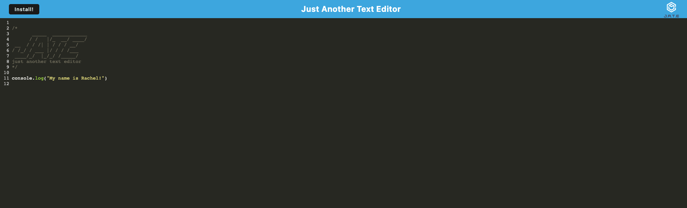
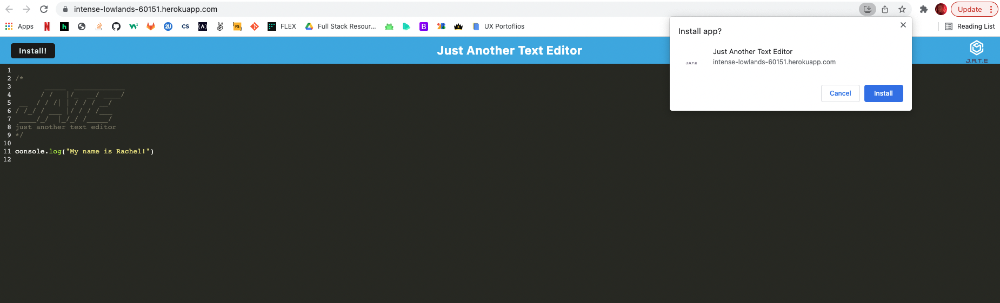
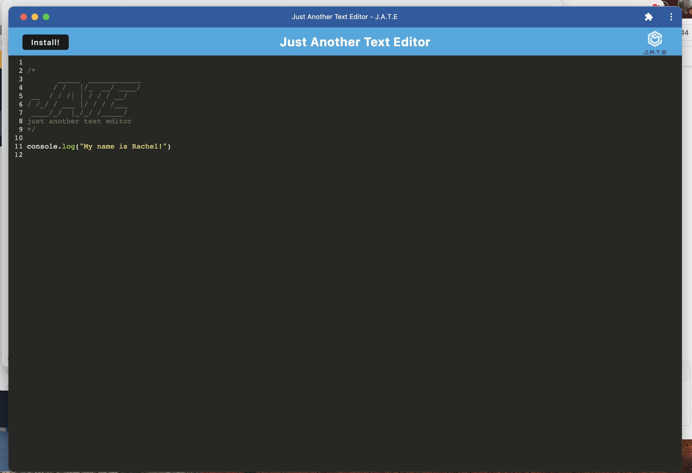

## PWA - Text Editor

## Link to Deployed Assets
https://racheldmarron.github.io/jate-the-pwa/ <br>
https://intense-lowlands-60151.herokuapp.com/

## Overview 
Using PWA criteria and IndexedDB API, this application is a text editor that runs in the browser. The application is also able to function offline by installing it to your local computer.

## User Story
```md
AS A developer
I WANT to create notes or code snippets with or without an internet connection
SO THAT I can reliably retrieve them for later use 
```

## Acceptance Criteria
```md
GIVEN a text editor web application
WHEN I open my application in my editor
THEN I should see a client server folder structure
WHEN I run `npm run start` from the root directory
THEN I find that my application should start up the backend and serve the client
WHEN I run the text editor application from my terminal
THEN I find that my JavaScript files have been bundled using webpack
WHEN I run my webpack plugins
THEN I find that I have a generated HTML file, service worker, and a manifest file
WHEN I use next-gen JavaScript in my application
THEN I find that the text editor still functions in the browser without errors
WHEN I open the text editor
THEN I find that IndexedDB has immediately created a database storage
WHEN I enter content and subsequently click off of the DOM window
THEN I find that the content in the text editor has been saved with IndexedDB
WHEN I reopen the text editor after closing it
THEN I find that the content in the text editor has been retrieved from our IndexedDB
WHEN I click on the Install button
THEN I download my web application as an icon on my desktop
WHEN I load my web application
THEN I should have a registered service worker using workbox
WHEN I register a service worker
THEN I should have my static assets pre cached upon loading along with subsequent pages and static assets
WHEN I deploy to Heroku
THEN I should have proper build scripts for a webpack application
```

## Installation
This application can be run using the deployed Heroku link. To run on your computer locally, follow these steps below:
<ul>
<li>Clone this repository to your computer</li>
<li>Run "npm install" in the command line of your terminal</li>
<li>Run "npm start" to start the application's backend</li>
<li>Go to http//:localhost:3001 to use</li>
</ul>

## Visual Representations
## Images 





## Contributors

- Thank you to my tutor Chris Baird for helping me work through some file structure and install errors

## License

This application is covered under MIT License    

[](https://opensource.org/licenses/MIT)

- - -
© 2022 Rachel Delaney Marron, Inc. All Rights Reserved.